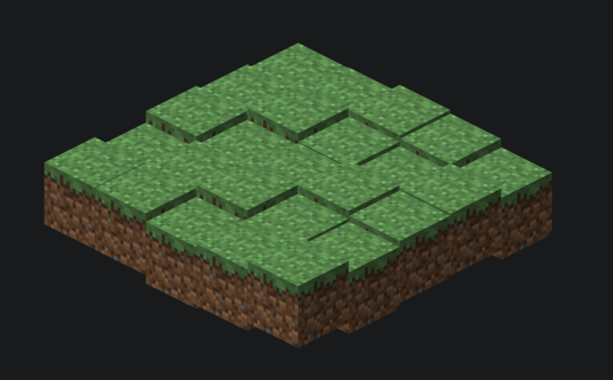

# Figuring out how isometric games work

# TODO
Figure out how to...
- [x] generate a megatile 
- [x] animate tiles
- [ ] address specific tile from "UI"
- [ ] add actors
- [ ] move actors
- [ ] add slopes
- [ ] add pits 
